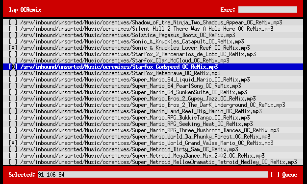

#Locate And Play

Locate And Play is a multipurpose Python script for selecting
media files to feed to Audacious Media Player (and possibly other
MPRIS-based players) or a command specified via `--exec`.

The name originally stood for "Locate, Audacious, Play" (a derivation of
"Audacious Play" because `ap` was the first subcommand to be written) and it
was originally announced
[on my blog](http://blog.ssokolow.com/archives/2013/05/24/a-little-tool-for-command-line-playlist-building/)
as part of my [roaming profile](https://github.com/ssokolow/profile).

### Usage

In the vein of classic UNIX utilities like `grep`, `fgrep`, and `egrep`, this
script will select a different set of default `--option` flags depending on
what name it's called under.

<dl>
<dt>aq &lt;path&gt; [...]</dt>
<dd>Add the given paths to the playlist.</dd>
<dt>ap &lt;path&gt; [...]</dt>
<dd>Like <code>aq</code> but start the first one playing too.</dd>
<dt>laq &lt;substring&gt; [...]</dt>
<dd>Like <code>aq</code> but use <code>locate -i</code> to search for the first argument, filter for known media types and filter for the following arguments, then display a chooser.</dd>
<dt>lap &lt;substring&gt; [...]</dt>
<dd>Like <code>laq</code> but start the first one playing too.</dd>
<dt>raq [path] [...]</dt>
<dd>Randomly select <code>-n NUM</code> songs (default: 10) from the paths provided (default: <code>XDG_MUSIC_DIR</code>) and add them to the playlist.</dd>
<dt>rap [path] [...]</dt>
<dd>Like <code>raq</code> but start the first one playing too.</dd>
</dl>

#### Noteworthy Options

<dl>
<dt><code>--exec &lt;command&gt;</code> or <code>-e &lt;command&gt;</code></dt>
<dd>Execute the specified commands with the chosen files as arguments.</dd>
<dt><code>--print</code> or <code>-p</code></dt>
<dd>Print the selected files, one per line, rather than playing/enqueueing.</dd>
<dt><code>--print0</code> or <code>-0</code></dt>
<dd>Like <code>--print</code> but use NUL characters as separators instead.</dd>
<dt><code>--show_path</code> or <code>-P</code></dt>
<dd>Use full paths rather than just filenames with <code>--print</code> and <code>--print0</code></dd>
</dl>

When displaying a chooser, there are two possible forms it can take: The
urwid-based one depicted above or a simple, fallback chooser with no
external dependencies.

### Requirements

* Python 2.x (Support for 3.x will come later)
* [locate](https://en.wikipedia.org/wiki/Locate_%28Unix%29) (Only required for
  variants beginning with `l`)
* [urwid](http://urwid.org/) (only required if you want the pretty chooser)
* dbus-python (only required if you want to play/enqueue via MPRIS)
